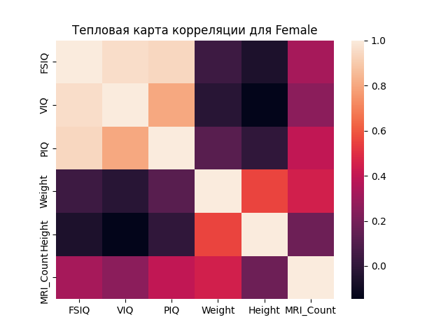

# Анализ размеров мозга в зависимости от интеллекта

## Описание
Этот проект анализирует связь между размером мозга и интеллектуальными показателями у разных полов. Данные загружаются из текстового файла, проводится их предварительная обработка, анализируются средние значения интеллектуальных показателей и их корреляция с объемом мозга, выраженным через количество пикселей на МРТ-снимках. Целью проекта является исследование возможной корреляции между физическими и интеллектуальными характеристиками человека.

## Функционал
- Загрузка и предварительная обработка данных из текстового файла.
- Вычисление средних значений интеллектуальных показателей.
- Анализ корреляции между размером мозга и интеллектуальными показателями.
- Визуализация корреляции для мужчин и женщин отдельно.
- Визуализация тепловых карт корреляции.

## Зависимости
Для работы программы необходимы следующие библиотеки:
- `pandas`
- `numpy`
- `matplotlib`
- `seaborn`

## Установка и запуск проекта
1. Клонируйте репозиторий:
```
git clone https://github.com/Sogato/BDA-lab5.git
```
2. Создайте виртуальное окружение:
```
python -m venv env
```
3. Установите зависимости проекта:
```
pip install -r requirements.txt
```
4. Запустите программу:
```
python main.py
```

## Пример использования
После запуска программы вы увидите в консоли статистический анализ данных. В директории проекта будут сохранены следующие файлы, визуализирующие результаты анализа:
- `мужская_correlation.png` — график корреляции между средним интеллектом и объемом мозга для мужчин.
- `женская_correlation.png` — график корреляции между средним интеллектом и объемом мозга для женщин.
- `heatmap_all.png` — тепловая карта корреляции для всех данных.
- `heatmap_женщин.png` — тепловая карта корреляции для женщин.
- `heatmap_мужчин.png` — тепловая карта корреляции для мужчин.

## Визуализация результатов

### Корреляция между средним интеллектом и объемом мозга


### Тепловые карты корреляции




---

Подготовлено в рамках учебного проекта. Все данные взяты из открытых источников и использованы исключительно в образовательных целях.

---

## Контрольные вопросы

### 1. Обратите внимание на диагональ слева направо в таблице корреляции. Почему диагональ заполнена единицами, это совпадение?

Диагональ таблицы корреляции заполнена единицами, потому что это корреляция каждой переменной с самой собой. В математическом смысле, корреляция переменной с самой собой всегда идеальная, то есть равна единице. Это не совпадение, а следствие определения корреляции.

### 2. Можно видеть, также что значения в таблице являются зеркальными, значения ниже единичной диагонали имеют зеркальный аналог выше этой диагонали. Почему?

Таблица корреляции симметрична относительно диагонали, потому что корреляция между двумя переменными X и Y является той же самой, независимо от того, считаем ли мы корреляцию X с Y или Y с X. Это свойство корреляции означает, что корреляционная матрица всегда будет симметричной относительно диагонали, что является отражением взаимной связи между парами переменных.

### 3. Многие переменные пары представляют корреляцию, близкую к нулю. Что это обозначает?

Корреляция близкая к нулю между двумя переменными указывает на отсутствие или очень слабую линейную связь между ними. Это означает, что изменения в одной переменной не связаны с систематическими изменениями в другой переменной. В контексте анализа данных, такие переменные не предоставляют значимой информации о взаимосвязи друг с другом в предметной области исследования.

### 4. Зачем было разделять данные по полу?

Разделение данных по полу было проведено с целью исследования возможных различий в корреляции между размером мозга и интеллектуальными показателями у мужчин и женщин. Такой подход позволяет выявить половые различия, которые могут быть важны для понимания биологических и психологических аспектов интеллекта.

### 5. Какие переменные имеют более сильную корреляцию с размером мозга (MRI_Count)? Это ожидаемо?

Согласно полученым данным, переменные, имеющие более сильную корреляцию с размером мозга (MRI_Count), включают `Weight` и `Height` для общей выборки, и в меньшей степени `PIQ` (Performance IQ) у мужчин. Это можно считать ожидаемым, так как более высокий вес и рост часто ассоциируются с большим объемом тела и, соответственно, с большим размером мозга. Корреляция с `PIQ` может указывать на возможную связь между некоторыми аспектами когнитивных способностей и физическими характеристиками мозга, однако для более глубоких выводов необходимо проведение дополнительных исследований с учетом других факторов.
